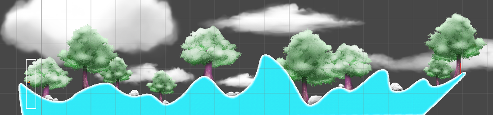

# Snow Boarder
A practice project while learning Unity 2D. A game where the snow boarder reaches the finish line without crashing to win.

## Layout

## Commands
**Spin Forward**: Right arrow key  
**Spin backward**: Left arrow key  
**Boost**: Up arrow key (while on the ground)  

## Rules
The player needs to control the snow boarder to reach the finish line safely.  
The player can adjust the snow boarder's position using left / right arrow key, or have a boost of speed by pushing up arrow key while on the ground.  
If the snow boarder crashes their head on the ground, the player loses the game and the level restarts from the beginning.